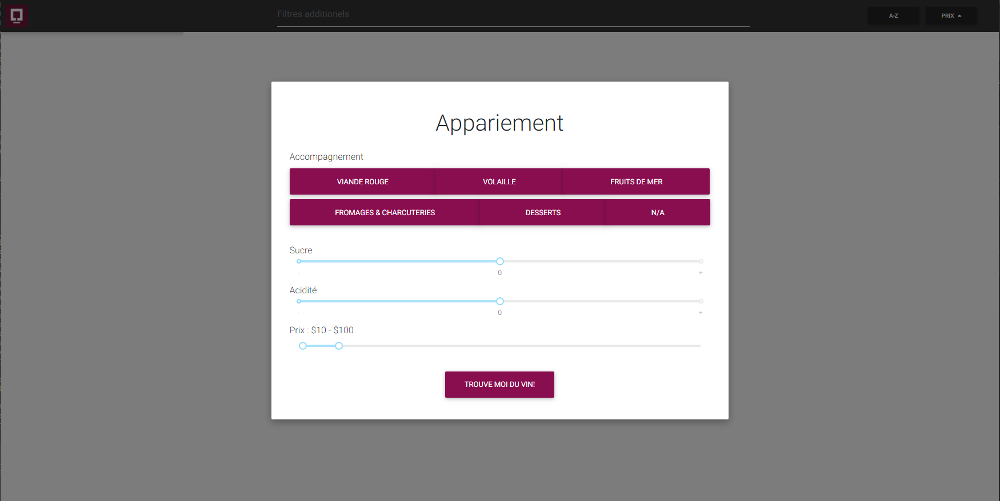
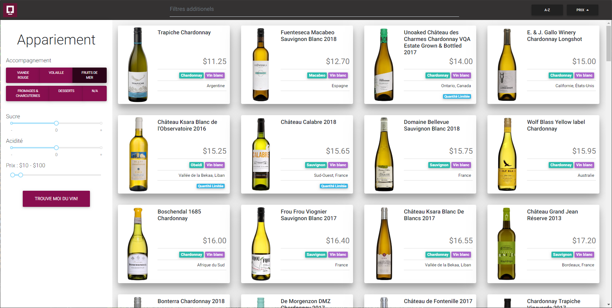

# Coveo Front End Challenge Response - Wine Pairing App

This web app was built as part of Coveo's [Front End Challenge](https://github.com/coveo/frontend-coding-challenge). The challenge was to create a search interface for an indexed collection of SAQ products. With guidelines being pretty loose, I decided to build a primitive iteration of a wine pairing tool. The app takes inputs describing what type of food the wine will be paired with along with consumer preferences and presents a list of suggestions.

## Installation

```bash
git clone https://github.com/nathanlb/CoveoWine
cd ./CoveoWine
npm install
```

**IMPORTANT NOTE:**
The Token for accessing the Coveo API is stored on my local machine in a `src/js/secret.js` file with the following structure:

```javascript
export default {
  APITOKEN: 'XXXXXXXX-XXXX-XXXX-XXXX-XXXXXXXXXXXXX',
}
```
In order to get a valid response from the API, you must create a file with your own access token.

## Start on localhost
```
npm start
```

## Run tests
```
npm test
```

---
## Framework

The web app uses the [React](https://reactjs.org/) framework to build the user interface. The choice was made as a result of my interest in deepening my knowledge of this framework which I'd recently started getting familiar with and am particularly fond of its component-based structure and approach to reusability.

## Styling

In an attempt to save time in styling the interface, I used [react-bootstrap](https://www.npmjs.com/package/react-bootstrap) and [mdbreact](https://www.npmjs.com/package/mdbreact) for most low-level components.

Custom styling was entirely done using javascript. This was limiting in some ways but had some simplification advantages. All in all, this was a test of which the conclusion is that it is unlikely I would opt for this solution again in the future.

## Usage

Upon loading, the page displays the input form as a modal overlay to acquire user input before suggestions can be made. The choice to use a modal version of the form alongside a sidebar version that will later be displayed is to play around with the concept of reusable React components and impose a certain flow order to the app's usage.





- The `Trouve moi du vin!` button at the bottom of the pairing form causes the Coveo API to be called with parameters vaguely corresponding to an appropriate pairing suggestion based on the form inputs.
- The product list displayed in card form can be ordered alphabetically or according to price in an increasing or decreasing fashion using the two buttons on the upper right-hand side of the search bar.
- The search bar itself allows for the addition of more filter attributes.  
*Currently the presence of the @tppagebody attribute returned by the API tends to mess with this feature as it contains several words that are completely unrelated to the product in question. Further investigation of this issue was given lower priority in favor of other tasks*
- Clicking on any of the product cards redirects the user to the official SAQ page for more information on the product.

## Project State

### Test Coverage
Not great. Time constraints, a focus on functionality, and neglect to use a TDD approach have left that part to be desired a little.

### Pairing Accuracy
As of now the pairing recomendation algorithm is mostly faked. Don't hold me accountable if you're disapointed by the recommendation results and your fancy dinner party is ruined. Also, the acidity and sugar slider, while functional, do nothing to influence the recommendations.

### File Structure and Separation of Component Facets
Separation of each components functional and presentational elements into separate files would have been ideal for testing, maintainability and adherance to industry best practices. However, having it them all in the same file did help with readability and quality of life during development. Given none of the components are overly complex, component scope and their corresponding files are still of a respectable size.

### Thoughts
- This was a blast!

